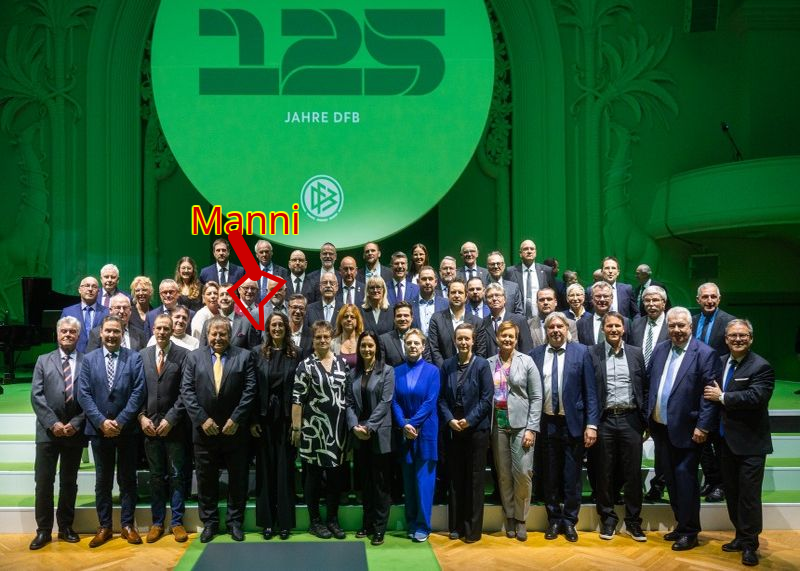
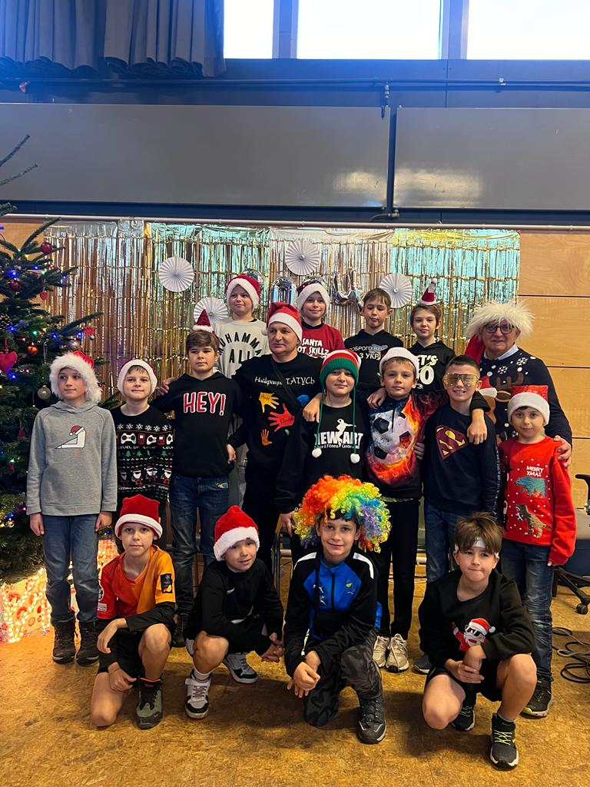

Am vergangenen Freitag durfte **Polonia Hamburg**, unser  Verein von der Finkenau, an einer ganz besonderen Veranstaltung teilnehmen: dem 125-jährigen Jubiläum des Deutschen Fußball-Bundes (DFB). Die Feierlichkeiten fanden in der geschichtsträchtigen Kongresshalle am Zoo in Leipzig statt – genau dort, wo der DFB vor 125 Jahren gegründet wurde. Es war ein Abend voller Geschichte, prominenter Gäste und unvergesslicher Momente, und unser Präsident **Manfred „Manni“ Wolny** war mittendrin.

### Polonia Hamburg vertritt Hamburg und die Basis des Fußballs

Als Teil der Delegation des Hamburger Fußball-Verbands hatten unser  Präsident "Manni" Wolny an diesem wichtigen Ereignis teilzunehmen. Unser Präsident Manni Wolny repräsentierte nicht nur Polonia Hamburg, sondern auch die Werte, die unseren Verein so besonders machen: **Integration, Vielfalt und Zusammenhalt**. Für uns war es ein stolzer Moment, als Verein mit Migrationshintergrund auf einer so großen Bühne wahrgenommen zu werden. Polonia Hamburg steht seit Jahren dafür, durch den Fußball Brücken zu bauen – sei es zwischen verschiedenen Kulturen oder zwischen Generationen. Mit unserer Arbeit fördern wir nicht nur sportliche Talente, sondern auch das Miteinander in unserer Gemeinschaft. Diese Werte spiegeln sich auch in der Feier wider, bei der der DFB die Basis des Fußballs und das Engagement der Ehrenamtlichen in den Vordergrund stellte.

### Begegnungen mit Legenden

Ein Höhepunkt des Abends war für unseren Präsidenten Manni Wolny der persönliche Austausch mit den ganz großen Namen des deutschen Fußballs. Besonders beeindruckend war die Begegnung mit **Rudi Völler**, der als Spieler und Funktionär seit Jahrzehnten eine prägende Figur des deutschen Fußballs ist. Der Weltmeister von 1990, liebevoll „Tante Käthe“ genannt, nahm sich Zeit für einen herzlichen Austausch mit Manni. Auch Bundestrainer **Julian Nagelsmann** begrüßte unseren Präsidenten und zeigte großes Interesse an der Arbeit von Polonia Hamburg. Solche Begegnungen sind nicht nur inspirierend, sondern auch eine großartige Möglichkeit, die Bedeutung von Vereinen wie Polonia in den Fokus zu rücken. „Es ist ein unvergesslicher Moment, mit Persönlichkeiten wie Rudi Völler und Julian Nagelsmann über unsere Arbeit sprechen zu dürfen“, sagte Manni Wolny nach der Veranstaltung. 

### Polonia Hamburg: Stolzer Botschafter des Hamburger Fußballs

Die Einladung nach Leipzig ist für uns eine Anerkennung der jahrelangen Arbeit, die wir bei Polonia Hamburg leisten. Unser Verein ist längst mehr als ein Fußballclub – er ist ein Ort der Begegnung, des Austauschs und der Gemeinschaft. Dass wir bei einem solch bedeutenden Jubiläum des DFB vertreten sein durften, zeigt, wie wichtig Vereine wie unserer für den deutschen Fußball sind. Unser Präsident Manni Wolny betonte: „Für uns bei Polonia Hamburg ist es eine große Ehre, Teil dieses historischen Ereignisses zu sein. Es zeigt, dass die Basis im Fußball, die tägliche Arbeit in den Vereinen und die Förderung von Integration und Vielfalt gesehen und geschätzt werden.“

### Ein Abend für die Geschichte

Die Feierlichkeiten zum 125-jährigen Bestehen des DFB in Leipzig waren ein beeindruckender Rückblick auf die reiche Geschichte des deutschen Fußballs. Doch sie zeigten auch, wie wichtig die Zukunft ist – eine Zukunft, in der Vereine wie Polonia Hamburg eine zentrale Rolle spielen. Wir sind stolz darauf, Teil dieser Feier gewesen zu sein und die Werte unseres Vereins in Leipzig vertreten zu haben. Es war ein Abend, der uns noch lange in Erinnerung bleiben wird und der uns darin bestärkt, unsere Arbeit mit Leidenschaft und Hingabe fortzusetzen. Polonia Hamburg – **Fußball, der verbindet.**
