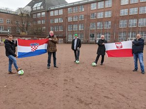
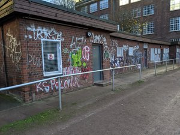

**Für mehr als zwei Millionen Euro entstehen zwischen Lerchenfeld und Finkenau ein neuer Sportplatz und eine Sporthalle. Im Rahmen der Baumaßnahmen wird die Straße „Birkenau“ als Fußweg wiederhergestellt. Damit zwei Sportvereine endlich angemessene Räumlichkeiten bekommen, steuert die Bezirksversammlung auf Antrag von GRÜNEN und SPD 150.000 Euro bei.** **Oliver Camp,** Sprecher für Sport der GRÜNEN Bezirksfraktion Hamburg-Nord: _„Das gemeinsame Nutzen des Fußballplatzes durch zwei kulturell unterschiedlich geprägte Organisationen ist ein gutes Beispiel für das Zusammenleben in einer vielfältigen Gesellschaft. Die Vereine übernehmen den Innenausbau der neuen Räume als Eigenleistung.“_ **Manfred Wolny** vom SV K.S. Polonia Hamburg und **Ivica Perić** von Croatia Hamburg - Kroatische Kulturgemeinschaft Hamburg erklären: _„Wir freuen uns über die einstimmige Entscheidung der Bezirksversammlung Hamburg Nord und bedanken uns bei allen Fraktionen! Polonia und Croatia bekommen eine echte Heimstätte und eine gute Perspektive für die Zukunft.“_ [https://gruene-nord.de/themen/bildung/bildung-volltext/alles\_neu\_am\_sportplatz\_birkenau\_sportvereine\_croatia\_und\_polonia\_bekommen\_neue\_raeume/](https://gruene-nord.de/themen/bildung/bildung-volltext/alles_neu_am_sportplatz_birkenau_sportvereine_croatia_und_polonia_bekommen_neue_raeume/) 
