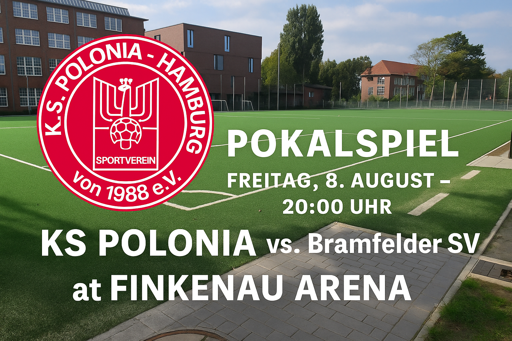

Zum Auftakt der neuen Saison empfängt **Kreisligist KS Polonia Hamburg** im heimischen Stadion an der Finkenau den ambitionierten **Landesligisten Bramfelder SV**. Eine echte Herausforderung – und gleichzeitig eine spannende Chance.

### **Polonia gut vorbereitet und mit klarer Ansage**

Cheftrainer **Naeem Ahmad** blickt mit Zuversicht auf die Partie:

> _„Wir haben uns punktuell gut verstärkt. Die Jungs haben in der Vorbereitung hart gearbeitet – wir wollen mutig auftreten und Nadelstiche setzen. Vielleicht gelingt uns die Pokalüberraschung.“_

Das Team ist hochmotiviert, die Neuzugänge haben sich gut eingefügt, und auch das Umfeld spürt die neue Energie im Verein.

### **Anreise & Hinweise zur Parksituation**

Wegen einer **Baustelle an der Finkenau** ist die Parksituation rund um das Stadion aktuell **stark eingeschränkt**.  
Wir empfehlen daher dringend die **Anreise zu Fuß, mit dem Fahrrad oder mit den Öffentlichen Verkehrsmitteln**.

### **Verpflegung & Stimmung garantiert**

Für das leibliche Wohl ist bestens gesorgt:  
✅ Der **Kiosk ist geöffnet**  
✅ Es gibt **polnische Bierspezialitäten & Snacks**  

* * *

**Seid dabei, unterstützt KS Polonia und erlebt einen packenden Pokalabend unter Flutlicht!**
