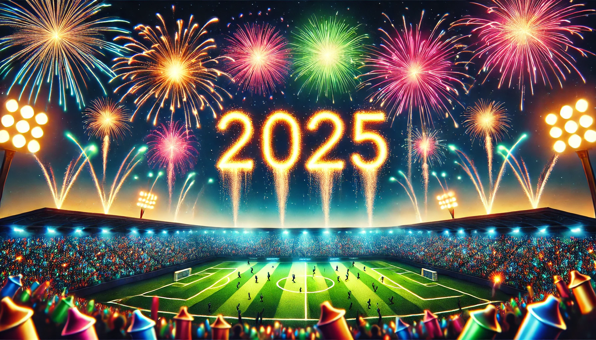

Unser Verein hat im Jahr 20234mit großem Engagement und Teamgeist am DFB-Punktespiel des Deutschen Fußball-Bundes teilgenommen und dabei das höchste Level erreicht: den Gold-Status! Damit startet unser Verein mit Stolz und Motivation ins neue Jahr 2025. Bereits zu Beginn des Spiels im Juli 2024 gehörte der KS Polonia zu den ersten 1000 Vereinen in Deutschland, die sich aktiv beteiligten. Durch das Erreichen des Gold-Status konnte der Verein wertvolle Prämien sichern, darunter neue Trainingsmaterialien und Ausrüstung, die unserer Jugendabteilung und der gesamten Vereinsarbeit zugutekommen. Um die erforderlichen Punkte zu sammeln, setzte der KS Polonia zahlreiche Maßnahmen um, darunter: Organisation von Schnuppertrainings für Neueinsteiger, Durchführung des DFB-Paule-Fußball-Abzeichens, Besuch des DFB-Mobils, Einführung neuer Fußballangebote im Verein, Qualifikation weiterer Jungendschiedsrichter, Vereins-Check zur Weiterentwicklung unserer Strukturen. Prämien für die Jugend und den Verein Mit den gesammelten Punkten entschied sich der KS Polonia für nützliche Prämien, die besonders unserer Jugend zugutekommen: 4 Minitore für den Kinderfußball, 20 Leibchen für das Training, 10 hochwertige EM-Spielbälle sowie einen Gutschein über 200 EUR für weiteres Trainingsmaterial.  Dank dieser Ausstattung können wir die Förderung unserer Nachwuchsspieler und den Spaß am Fußball noch weiter stärken. Ein großes Dankeschön und beste Wünsche fürs neue Jahr Unser besonderer Dank gilt allen Mitgliedern, Unterstützern und Freunden des KS Polonia, die mit ihrem Einsatz und Engagement diesen Erfolg ermöglicht haben. Ihr seid das Herz unseres Vereins! Wir wünschen allen Mitgliedern, Fans und Unterstützern ein gesundes, glückliches und erfolgreiches neues Jahr 2025. Möge es voller sportlicher Höhepunkte und schöner gemeinsamer Momente sein!
