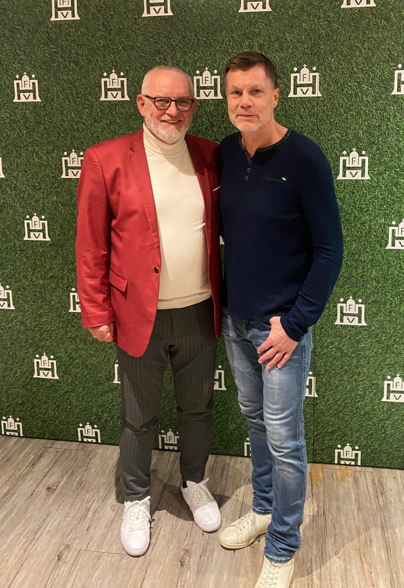
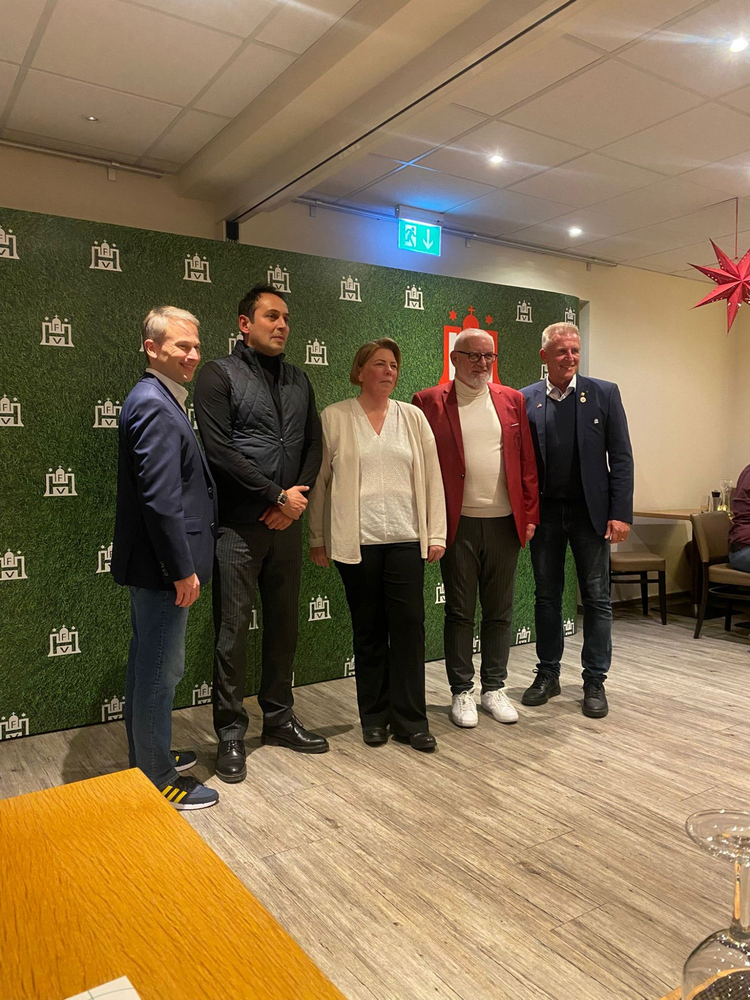
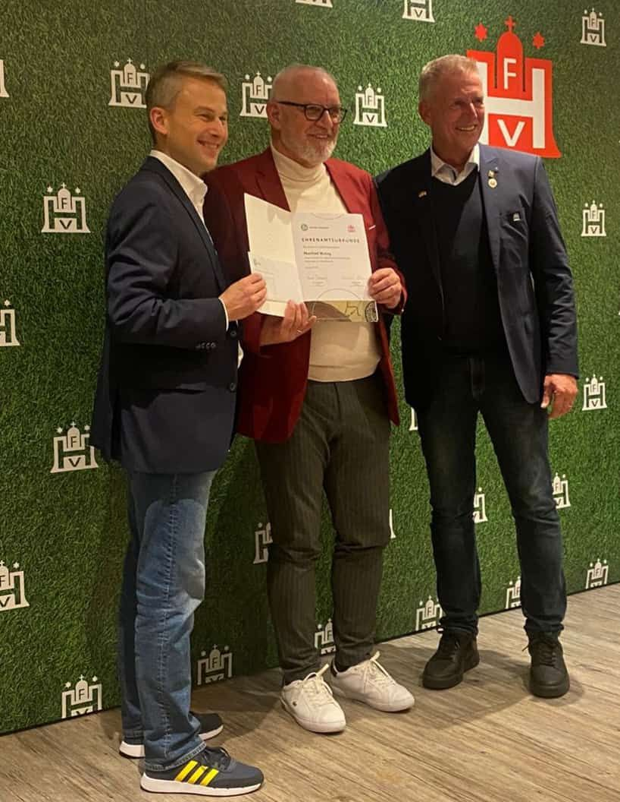
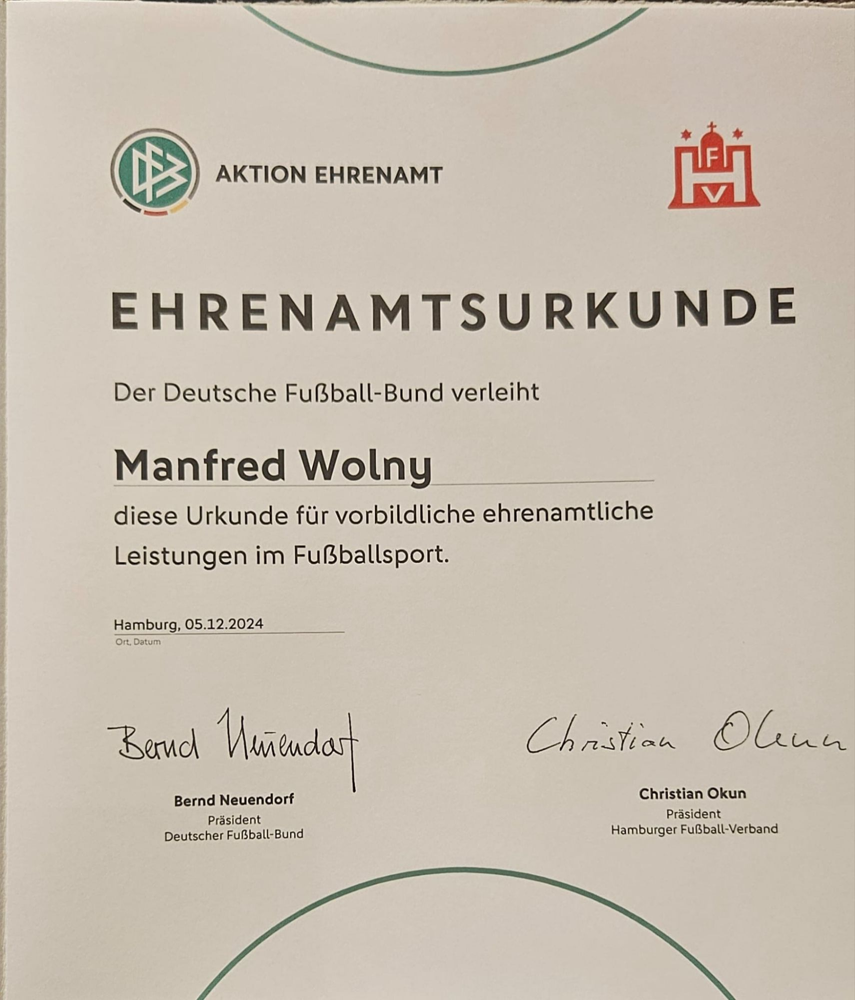

Mit großem Stolz und Freude dürfen wir verkünden, dass unser Präsident Manfred Wolny vom DFB mit dem Ehrenamtspreis 2025 ausgezeichnet wurde. Diese besondere Ehrung ist eine Anerkennung für sein außergewöhnliches Engagement und seinen unermüdlichen Einsatz für unseren Fußballverein KS Polonia Hamburg.  
  
**Ein würdiger Preisträger**  
  
Manfred Wolny ist seit Jahren das Herz und die Seele unseres Vereins. Mit seiner Leidenschaft, Hingabe und unermüdlichen Arbeit hat er nicht nur den Verein, sondern auch die lokale Fußballgemeinschaft maßgeblich geprägt. Ob auf oder neben dem Platz – Manfred ist stets mit vollem Einsatz dabei und ein Vorbild für alle Mitglieder und Ehrenamtliche.  
  
Sein Engagement reicht weit über die alltägliche Vereinsarbeit hinaus: Ob Organisation von Turnieren, Unterstützung von Jugendmannschaften oder die Förderung der Integration durch den Sport – Manfred Wolny hat immer eine Vision, die den Fußball als verbindendes Element in den Mittelpunkt stellt.  
  
**Feierliche Preisverleihung durch den HFV**  
  
Die Verleihung des Ehrenamtspreises fand in einem festlichen Rahmen durch den Hamburger Fußball-Verband (HFV) statt. Die Auszeichnung wurde von Christian Okun, dem Vorsitzenden des HFV, und dem ehemaligen Nationalspieler Thomas Helmer überreicht. Beide betonten in ihren Reden, wie wichtig ehrenamtliches Engagement für den deutschen Fußball sei und hoben die besondere Bedeutung von Manfred Wolnys Arbeit hervor.  

  
Thomas Helmer, bekannt aus seiner erfolgreichen Karriere als Spieler der deutschen Nationalmannschaft, lobte die Leidenschaft und Beharrlichkeit, mit der Manfred sich für den Verein und den Sport einsetzt. Er sagte:  
"Menschen wie Manfred Wolny sind das Rückgrat des Fußballs. Sie sorgen dafür, dass der Sport lebt und gedeiht. Sein Einsatz ist inspirierend und verdient unseren höchsten Respekt."  
  
**Ein besonderer Moment für KS Polonia**  
  
Für unseren Verein bedeutet diese Auszeichnung nicht nur eine Würdigung der Arbeit von Manfred Wolny, sondern auch eine Anerkennung für alle, die sich bei KS Polonia engagieren. Es zeigt, dass Zusammenhalt, Engagement und Herzblut gesehen und geschätzt werden.  
  
Wir danken dem DFB und dem HFV für diese besondere Ehrung und sind unglaublich stolz, einen Präsidenten wie Manfred Wolny an unserer Seite zu haben. Er hat nicht nur den Verein, sondern auch die Werte des Fußballs in unserer Gemeinschaft nachhaltig geprägt.  
  
Lieber Manfred, wir gratulieren dir von ganzem Herzen zu dieser wohlverdienten Auszeichnung und freuen uns auf viele weitere erfolgreiche Jahre mit dir an der Spitze unseres Vereins!  
  
KS Polonia Hamburg – Gemeinsam stark durch Fußball!

