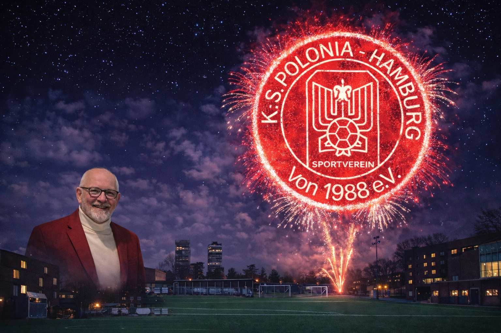

Liebe Mitglieder, Freunde und Unterstützer der Polonia,

wir blicken mit Hoffnung, Zuversicht und Vorfreude auf das Jahr **2026**. Nach herausfordernden Zeiten wünschen wir uns allen vor allem **Frieden, Gesundheit und Zusammenhalt** – Werte, die unseren Verein seit jeher prägen. Polonia ist mehr als Sport: Sie ist Begegnung, Integration, Freundschaft und ein Stück Heimat für viele Generationen.

### Fußball verbindet – besonders im WM-Jahr 2026

Ein sportliches Highlight des kommenden Jahres wird zweifellos die **Fußball-Weltmeisterschaft 2026** sein. Ein Turnier, das Menschen auf der ganzen Welt vereint und Emotionen über Ländergrenzen hinweg schafft. Wir hoffen auf ein spannendes, faires und mitreißendes Turnier mit starken Mannschaften wie **Deutschland, Polen, der Ukraine** und vielen weiteren Nationen. Der internationale Fußball zeigt eindrucksvoll, wie Sport Brücken bauen und Gemeinschaft fördern kann.

### Polonia wächst – auch über den Fußball hinaus

Mit großer Freude können wir sagen: **Polonia entwickelt sich weiter**. Neben dem Fußball gewinnen auch andere Abteilungen zunehmend an Bedeutung.

Besonders stolz sind wir auf die neu gegründeten **Polonia Baskets**, unser Basketballangebot für **Kinder, Jugendliche und Erwachsene**. Die Begeisterung für den Basketball wächst stetig, und es ist schön zu sehen, wie sich hier neue Teams, Freundschaften und sportliche Perspektiven entwickeln.

Auch unsere **Badminton-Spielerinnen und -Spieler** tragen aktiv zum lebendigen Vereinsleben bei. Mit Engagement, Spaß und sportlichem Ehrgeiz zeigen sie, wie vielfältig Polonia heute aufgestellt ist.

### Blick in die Zukunft: Die neue Halle am Sportplatz

Ein weiterer großer Schritt für unseren Verein steht bevor: **Die neue Halle am Sportplatz**, deren Eröffnung für **2026** geplant ist. Sie wird neue Trainingsmöglichkeiten schaffen, insbesondere für unsere Hallensportarten, die Jugend- und Vereinsarbeit stärken und Polonia langfristig neue Perspektiven eröffnen. Die Halle ist ein starkes Zeichen für Wachstum, Nachhaltigkeit und die Zukunft unseres Vereins.

### Gemeinsam nach vorne

Für das Jahr 2026 wünschen wir uns:

-   sportliche Erfolge und faire Wettkämpfe
    
-   eine starke Jugend- und Nachwuchsarbeit
    
-   lebendige Abteilungen von Fußball über Basketball bis Badminton
    
-   und vor allem: **ein friedliches, respektvolles Miteinander**
    

Lasst uns gemeinsam nach vorne schauen, Brücken bauen und Polonia als Ort der Gemeinschaft weiter stärken – auf dem Spielfeld, in der Halle und darüber hinaus.

In diesem Sinne wünschen wir **allen Polonia-Mitgliedern, Freunden und ihren Familien ein frohes, gesundes und friedliches Jahr 2026**. Möge es ein Jahr voller sportlicher Highlights, neuer Chancen und gemeinsamer Erfolge werden.

**Alles Gute für 2026 – und auf eine starke Polonia!**
