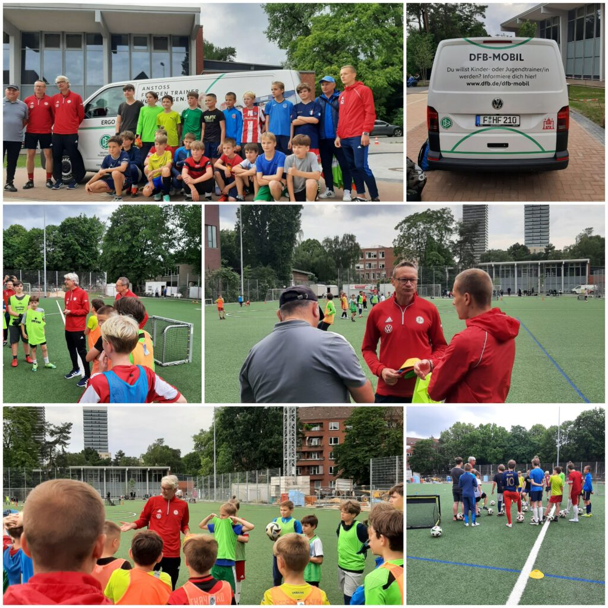

Zehn Tage vor dem Start der Europameisterschaft statteten Christoph und Markus vom Deutschen Fußballbund (DFB) dem KS Polonia einen Besuch ab. Doch diesmal waren keine Scouts auf der Suche nach Talenten vor Ort. Stattdessen brachten sie das DFB-Mobil mit, ein Projekt des DFB, das Trainer und Vereinsmitarbeiter mit praktischen Tipps für das Jugendtraining unterstützt und über aktuelle Fußballthemen informiert.

Markus leitete ein dynamisches Demo-Training mit Spielern aus unseren Jugendmannschaften. Dabei standen aktuelle Trainingsformen im Fokus, die allen Spielern viele Ballkontakte ermöglichten und die ganze Trainingsgruppe in Bewegung hielten. Unsere Übungsleiter Sascha, Tengiz und Wolodymyr können nun von den neuen Trainingsideen profitieren.

Ein herzliches Dankeschön an Christoph und Markus für diesen informativen und abwechslungsreichen Nachmittag!

