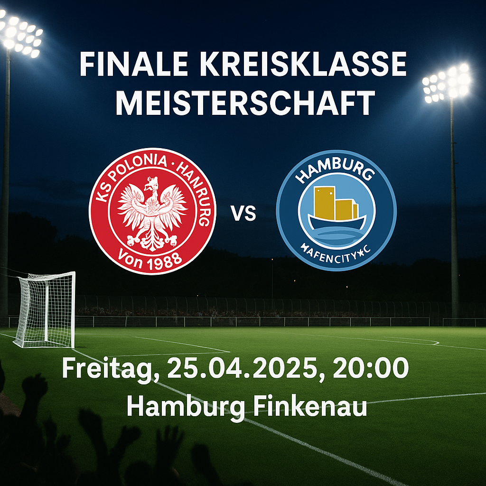

Am **Freitag, 25. April** geht es **an der Finkenau** um alles: **Meisterschaft, Aufstieg** und Ruhm in der **Kreisklasse D**. Ein echtes Finale, wie es im Buche steht!

**Gastgeber KS Polonia Hamburg** hofft nach nur einem Jahr in der Kreisklasse auf die ersehnte Rückkehr in die Kreisliga. Die Mannschaft hat sich in dieser Saison stark präsentiert und will mit einem Heimsieg den letzten Schritt zum Titel machen. **Gast und Herausforderer HafenCity FC** hingegen hat ebenfalls Großes vor: Der Liganeuling strebt den **Durchmarsch** an und könnte mit einem Sieg nicht nur die Sensation perfekt machen, sondern sich auch als ernstzunehmende Kraft im Hamburger Amateurfußball etablieren.

Doch nicht nur der Teamtitel steht auf dem Spiel – auch die **Torjägerkrone der Liga** sorgt für zusätzliche Spannung: **Oleksandr Hetman** von Polonia führt mit beeindruckenden **36 Treffern** die Torschützenliste an, dicht gefolgt von **Johannes Engels** vom HafenCity FC, der bereits **32 Tore** auf dem Konto hat. Beide werden alles geben, um ihrer Mannschaft zum Sieg zu verhelfen – und sich vielleicht auch noch die persönliche Auszeichnung zu sichern.

**Cheftrainer Ahmad Naeem** und sein Team haben sich akribisch auf dieses Endspiel vorbereitet. Die Vorfreude ist groß – jetzt zählt es!

Wir drücken allen Spielern die Daumen und hoffen auf ein packendes Spiel vor großer Kulisse. **Kommt vorbei und unterstützt euer Team – Anstoß ist um 20:00 Uhr an der Finkenau!**

⚽? **Finale Kreisklasse D – Spannung, Emotionen, Fußball pur!** ?⚽

[reactoonz](https://reactoonzpelit.com/)
