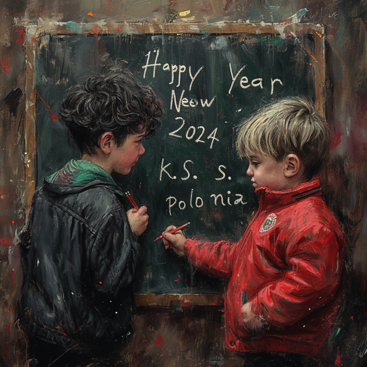

Liebe Mitglieder des KS Polonia, das Jahr 2023 war für unseren Verein eine Zeit der gemeinsamen Herausforderungen und zugleich eine Zeit des beeindruckenden Zusammenhalts. Wir möchten uns von Herzen bei jedem einzelnen von euch bedanken, der zu den positiven Entwicklungen und dem starken Gemeinschaftsgefühl beigetragen hat.  Euer unermüdlicher Einsatz, eure Hingabe und euer Teamgeist haben KS Polonia zu einem Ort gemacht, an dem wir nicht nur Sport treiben, sondern auch als Familie zusammenstehen. In diesem Zusammenhang möchten wir besonders unsere ukrainischen Mitglieder hervorheben, die in einer Zeit des Krieges in der Ukraine einen besonderen Beitrag zur Solidarität und Gemeinschaft geleistet haben. Trotz der Herausforderungen haben wir als Verein Großartiges erreicht, und das verdanken wir jedem von euch. Der Vorstand von KS Polonia möchte allen Mitgliedern ein herzliches Dankeschön aussprechen und gleichzeitig unsere Gedanken und Unterstützung an unsere ukrainischen Freunde senden, die in diesen schweren Zeiten besondere Stärke zeigen. Möge das neue Jahr 2024 für uns alle ein Jahr des Friedens, des Zusammenhalts und des gemeinsamen Erfolgs werden. Der Vorstand von KS Polonia wünscht euch und euren Familien ein frohes und gesundes neues Jahr. Lasst uns gemeinsam weiter wachsen, uns unterstützen und als Verein noch stärker werden. Auf ein Jahr voller Hoffnung, Solidarität und sportlicher Erfolge! Mit herzlichen Grüßen, Manfred Wolny, Erster Vorsitzender KS Polonia
