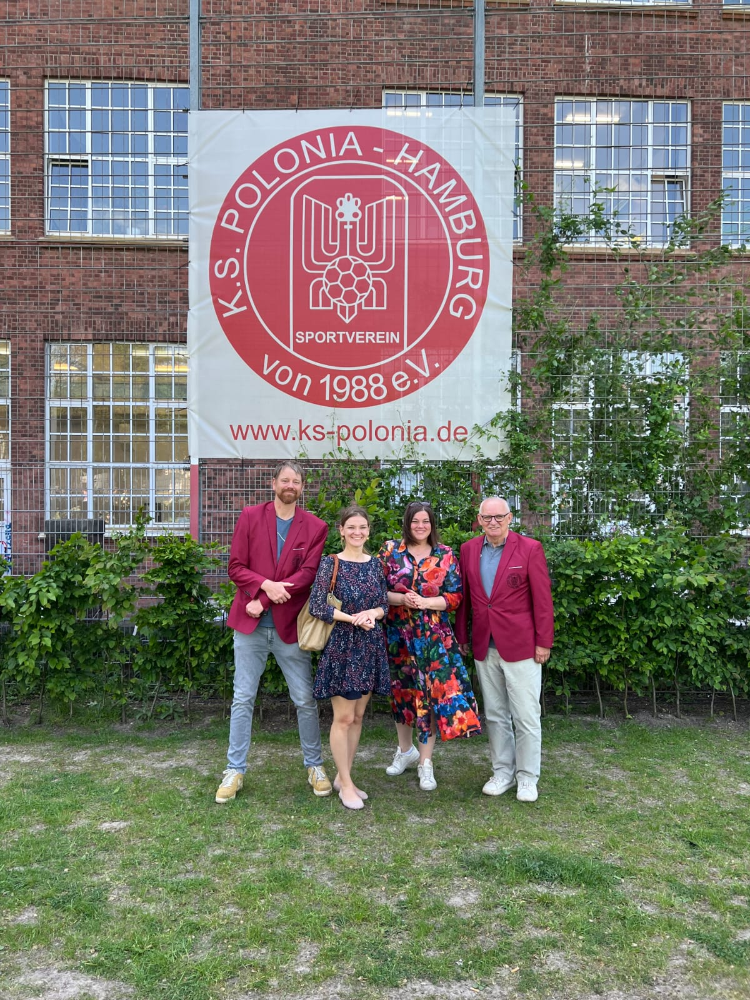

Im vergangenen Monat erlebte der KS Polonia Hamburg einen besonderen Moment: Katharina Fegebank, die Zweite Bürgermeisterin der Freien und Hansestadt Hamburg und Senatorin, besuchte die Finkenau und traf sich dort mit Manfred Wolny, umserem Vereinspräsidenten des KS Polonia, und Carsten Bullemer, dem engagierten Jugendbetreuer des Vereins. **Herzliche Atmosphäre bei Kaffee und Kuchen** Der Besuch begann in einer herzlichen Atmosphäre bei Kaffee und Kuchen, was den Rahmen für angeregte Gespräche und einen intensiven Informationsaustausch bot. Die Themen des Tages waren vielfältig und von großer Bedeutung für den Verein und die Gemeinschaft. **Neubau der Sporthalle** Ein zentrales Thema war der Bau der neuen Sporthalle. Der KS Polonia setzt sich seit langem für bessere Sportstätten ein, um den zahlreichen Mitgliedern, insbesondere den Jugendlichen, optimale Trainingsbedingungen zu bieten. Frau Fegebank zeigte sich beeindruckt vom Engagement des Vereins und sicherte zu, dieses wichtige Projekt weiter zu unterstützen. Die neue Sporthalle soll nicht nur den Sportbetrieb verbessern, sondern auch als Begegnungsstätte für verschiedene Gemeinschaften dienen. **Integration von geflüchteten Jugendlichen** Ein weiteres zentrales Thema war die Integration von geflüchteten Jugendlichen. Der KS Polonia leistet hier seit Jahren herausragende Arbeit. Durch sportliche Aktivitäten und gemeinsame Projekte wird den jungen Geflüchteten nicht nur eine sinnvolle Freizeitgestaltung geboten, sondern auch eine wichtige Plattform für den Austausch und die Integration in die Gesellschaft. Katharina Fegebank betonte die Bedeutung solcher Initiativen und versprach, weiterhin die notwendige Unterstützung der Stadt für diese wertvolle Arbeit zu gewährleisten. **Engagement des KS Polonia als Stadtteilverein** Der KS Polonia ist weit mehr als nur ein Sportverein. Er ist ein wichtiger Pfeiler im sozialen Gefüge des Stadtteils und engagiert sich intensiv für die Gemeinschaft. Ob durch kulturelle Veranstaltungen, Nachbarschaftshilfe oder Bildungsprojekte – der Verein ist stets darum bemüht, das Miteinander zu fördern und einen positiven Beitrag zum Stadtleben zu leisten. Frau Fegebank lobte dieses breite Engagement und betonte, wie wichtig solch aktive Vereine für das soziale Klima und den Zusammenhalt in Hamburg sind. **Ausblick auf zukünftige Unterstützung** Zum Abschluss des Besuchs wurde vereinbart, weitere Gespräche zu führen und die Unterstützung der Stadt für die Aktivitäten des KS Polonia fortzusetzen. Der Verein hat mit diesem Besuch nicht nur Wertschätzung für seine bisherige Arbeit erfahren, sondern auch eine wichtige Grundlage für zukünftige Projekte gelegt. 
