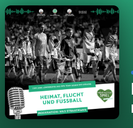

**Heimat , Flucht und Fußball** 

Mehr als ein Spiel - mit K.S. Polonia Hamburg  
Und dann schießt Leroy Sané den Ball an die Latte. Kurz stockt der Atem, dann ist Halbzeit. Durchatmen. Weiterhin 1:2 für die Ukraine. Dieses 3:3 der Nationalelf im 1000. Länderspiel wurde sportlich viel diskutiert. Doch es wurde mitunter außer Acht gelassen, welch Fest es auf den Rängen war. Nicht zuletzt bei einer Gruppe von knapp 40 Kindern, die vor einem Jahr aus der Ukraine geflüchtet waren und die von der DFB-Stiftung Egidius Braun zum Spiel nach Bremen eingeladen waren. Wir haben diese Kinder begleitet. Und waren mit ihnen ganz nah dran an den großen Träumen.

Anhören unter:   [https://open.spotify.com/episode/3gzuCRJ8w49wAWgGYs5e8D](https://open.spotify.com/episode/3gzuCRJ8w49wAWgGYs5e8D)

 
