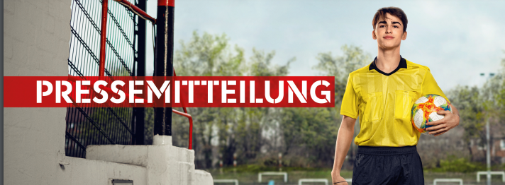

Der K.S. Polonia ist auf der Suche nach neuen Schiedsrichtern sowie Interessenten und Interessentinnen, die sich zum Schiedsrichter ausbilden lassen möchten. **Was euch erwartet:**

-   **Kostenfreie Ausbildung:** Die Lehrgänge finden meist im Umkreis von 25 km statt.
-   **Beitragsfreie Vereinsmitgliedschaft:** Ihr werdet beitragsfreie Mitglieder im Verein.
-   **Freier Eintritt:** Als ausgebildete Schiedsrichter seid ihr berechtigt, kostenfrei alle Spiele des DFB zu besuchen, einschließlich der Spiele der 1. und 2. Bundesliga.
-   **Kostenlose Schiedsrichterkleidung und -ausrüstung:** Der Verein stellt euch die benötigte Kleidung und Ausrüstung kostenlos zur Verfügung.
-   **Fahrtkostenpauschale und Aufwandsentschädigungen:** Für jedes geleitete Spiel erhaltet ihr eine Fahrtkostenpauschale und Aufwandsentschädigungen, deren Höhe von der Spielklasse abhängt.

**Voraussetzungen:**

-   **Mindestalter 12 Jahre:** Ihr müsst mindestens 12 Jahre alt sein.
-   **Teilnahme an einem Schiedsrichter-Anwärterlehrgang:** Dieser Lehrgang erstreckt sich in der Regel über drei Wochenenden.
-   **Einsatzbereitschaft:** Ihr müsst bereit sein, regelmäßig als Schieds- oder Linienrichter Spiele zu leiten (mindestens 15 Spiele pro Saison).

**Bei Interesse:** Bitte schickt einfach eine Email an info@ks-polonia.de. Wir freuen uns auf eure Bewerbungen und darauf, euch in unserem Team willkommen zu heißen! [Pressemitteilung downloaden](../../../assets/images/press-release.pdf) 

Objevte prémiový online casino zážitek na [Cashed Casino](https://cashedcasino.cz/) – stovky automatů, živé hry, štědré bonusy a 24/7 podpora. Zaregistrujte se nyní a získejte bonus až do výše €500 + 200 free spinů.
