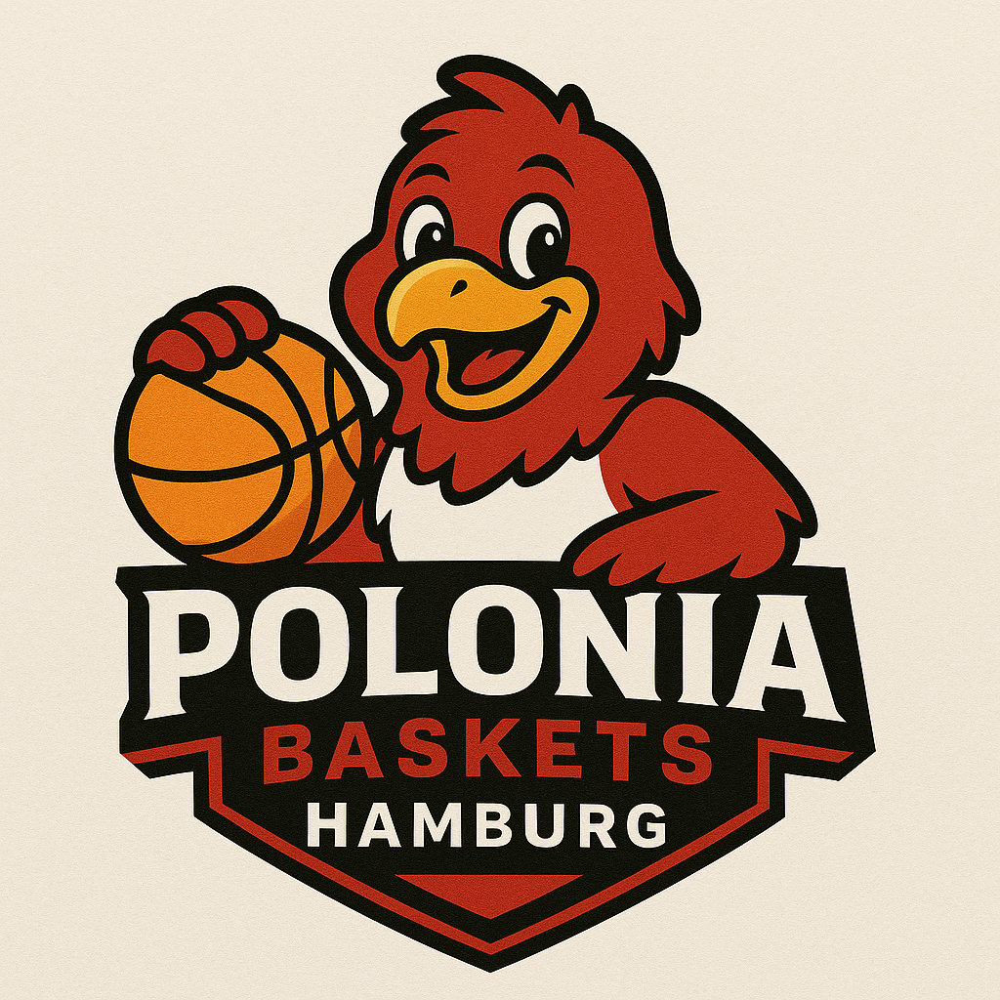

Basketball boomt in Deutschland – spätestens seit dem **WM-Titel 2023** und dem **EM-Sieg 2025** der deutschen Herren-Nationalmannschaft um **Dennis Schröder** und **Franz Wagner** ist die Begeisterung riesig. Die Erfolge haben eine neue Generation von Basketballfans inspiriert – vor allem viele Kinder wollen jetzt selbst den Ball in die Hand nehmen.

Diesen Schwung nimmt der **KS Polonia** auf und bringt den Sport nun in den Hamburger Stadtteil **Uhlenhorst an der Finkenau**: Unter dem Namen **KS Polonia Basketball** entsteht eine neue Abteilung mit klarer Ausrichtung auf Nachwuchs und Familien.

* * *

## Was startet jetzt?

-   **Neue Sparte:** KS Polonia Basketball
    
-   **Standort:** Uhlenhorst (an der Finkenau)
    
-   **Teams zum Start:**
    
    -   **U10-Kindermannschaft** (Jahrgänge **2016/2017**)
        
    -   **Seniorenteam / Väter-Ü40** (in Planung)
        

* * *

## Warum Basketball beim KS Polonia?

-   **Dynamischer Teamsport:** fördert Koordination, Ausdauer, Respekt und Teamgeist
    
-   **Niedrige Einstiegshürden:** Ball, Hallenschuhe – los geht’s.
    
-   **Gemeinschaft:** familiäre Vereinsatmosphäre, kurze Wege im Viertel.
    

Der Boom des Basketballs in Deutschland zeigt: Diese Sportart verbindet Generationen – von jungen Talenten bis zu erfahrenen Spielern, die einfach wieder Spaß am Spiel haben wollen.

* * *

## Trainingsorte

-   **Jetzt:** Sporthalle **Uferstraße/Wagnerstraße**
    
-   **Demnächst:** zusätzliche Kapazitäten in der Sporthalle **an der Finkenau**
    

_(Genaue Trainingstage und -zeiten folgen nach der finalen Hallenvergabe.)_

* * *

## Mitmachen: U10-Tryouts im November

Wir suchen noch motivierte **Kinder der Jahrgänge 2016 und 2017** für unsere neue **U10**.  
**Anmeldung & Fragen:** `basketball@ks-polonia.de`

> Bitte schreibt in die Mail kurz den **Namen des Kindes**, **Geburtsjahr**, und ob bereits **Basketball- oder Vereinserfahrung** vorhanden ist. Wir melden uns umgehend mit Termin und Infos.

* * *

## Väter-Ü40: Vormerken!

Parallel planen wir eine **Seniorenmannschaft / Väter-Ü40** – ideal für Einsteiger, Wiedereinsteiger und alle, die wieder regelmäßig Körbe werfen möchten.  
**Interesse?** Ebenfalls kurz per Mail melden: `basketball@ks-polonia.de`.

* * *

## So läuft’s ab

1.  **Anmelden** per E-Mail für die Tryouts (U10) bzw. Interessenliste (Ü40).
    
2.  **Vorbeikommen**, Hallenluft schnuppern, Team kennenlernen.
    
3.  **Starten:** Gemeinsam bauen wir KS Polonia Basketball Schritt für Schritt auf.
    

* * *

## Über KS Polonia

KS Polonia steht in Hamburg für **Sport, Werte und Zusammenhalt**. Mit der neuen Basketballsparte erweitern wir unser Angebot – für Kinder, Eltern und alle, die Spaß an Bewegung und Teamgeist haben.  
Getreu dem Motto: _Gemeinsam stark – auf und neben dem Spielfeld!_

* * *

### Kurz & knapp (für eilige Leser:innen)

-   **Neu:** KS Polonia Basketball in Uhlenhorst
    
-   **Teams:** U10 (2016/2017) – Ü40/Väter in Planung
    
-   **Hallen:** Uferstraße/Wagnerstraße – später auch an der Finkenau
    
-   **Tryouts (November):** Kinder 2016/2017 gesucht - Bewerbung per Email
    
-   **Kontakt:** `basketball@ks-polonia.de`
    
-   **Ansprechpartner** : Carsten Bullemer

* * *

_Kommt vorbei, bringt Freunde mit – und werft mit uns die ersten Körbe beim KS Polonia Basketball!_ 🏀
