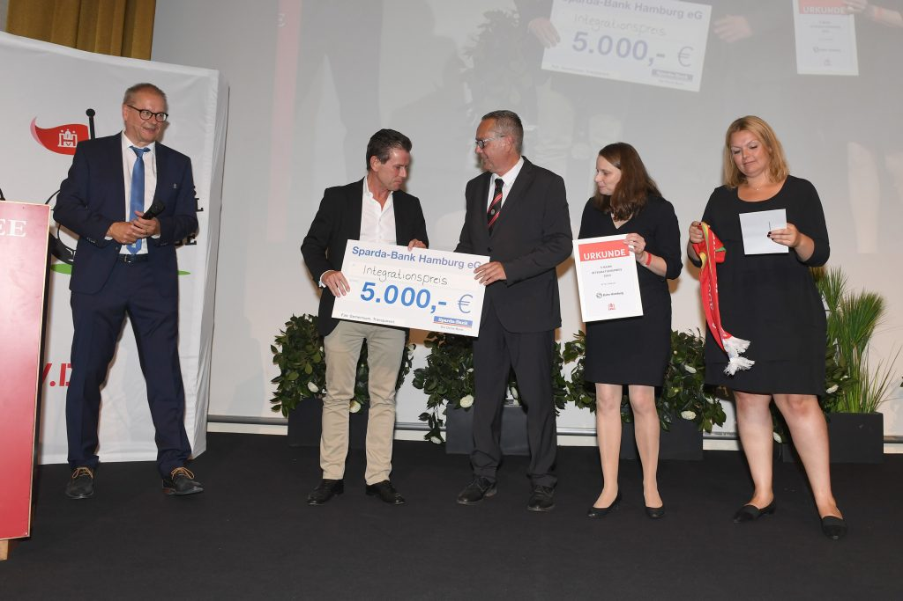

 „Durch unseren engen Bezug zur Ukraine und persönlichen Kontakten zu bereits in Hamburg lebenden ukrainischen Staatsangehörigen haben wir bisher fast 60 jugendliche ukrainische Flüchtlinge in unseren sehr kleinen Verein aufgenommen und sage und schreibe 5 (!!!) Jugendmannschaften zum Spielbetrieb für die Saison 2022/2023 angemeldet.“ So begann Manfred Itzen, 2. Vorsitzender des KS Polonia, die Bewerbung seines Vereins für den Integrationspreis 2022. Dass der KS Polonia beim Jahresempfang des Hamburger Fußball-Verbandes am 29. August tatsächlich mit dem Preis ausgezeichnet wurde, kam aber dann doch überraschend für den kleinen Verein nahe der Hamburger Mundsburg. Glücklich nahm Manfred Itzen den von der S-Bahn Hamburg gestifteten und mit 5.000 Euro dotierten Preis entgegen. Überreicht wurden Scheck, Urkunde und Schal von S-Bahn Hamburg-Chef Kay-Uwe Arnecke, Sozialsenatorin Dr. Melanie Leonard und HFV-Vizepräsidentin Kathrin Behn. Durch seine privaten Verbindungen in die Ukraine sei die Integration der ukrainischen Spieler zwar eine Herzensangelegenheit, aber auch mit hohem zeitlichem und finanziellem Aufwand verbunden“, berichtet Itzen und ergänzt: „Inzwischen sind es sogar 69 ukrainische Jugendliche, die wir aufgenommen haben“. Quelle: [https://www.hfv.de/ks-polonia-gewinnt-integrationspreis-2022/](https://www.hfv.de/ks-polonia-gewinnt-integrationspreis-2022/)
