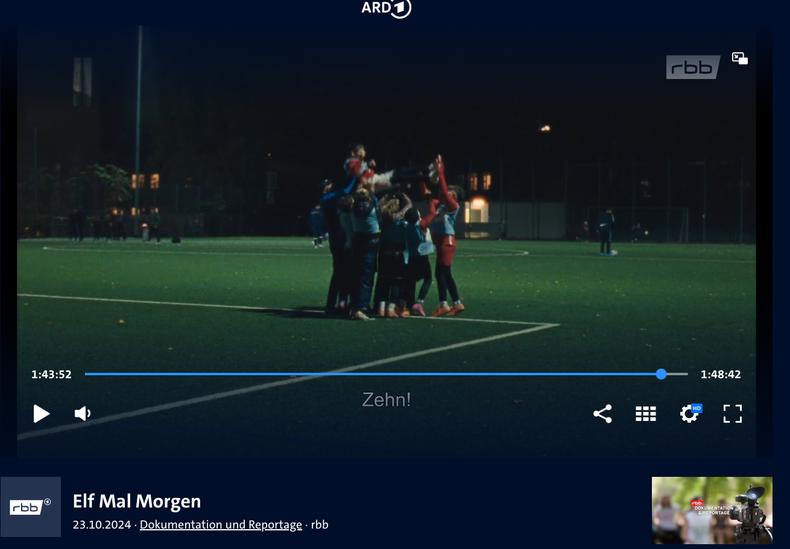

Die Berlinale 2024 bringt nicht nur Kinomagie auf die Leinwände, sondern zeigt auch, wie nah sich Film und Fußball kommen können. Im Rahmen des Kurzfilmprogramms **„Elf mal Morgen“**, das in Kooperation mit „Berlinale Meets Fußball“ entstanden ist, wurde eine beeindruckende Dokumentation gedreht. Dabei ist auch unsere **D-Jugend-Mannschaft des KS Polonia** unter der Leitung ihres engagierten Trainers Tengiz Teil dieser besonderen Produktion. Der Film ist jetzt in der **ARD Mediathek** verfügbar und erzählt die Geschichten, die den Fußball und das Leben gleichermaßen berühren.

## **Elf mal Morgen: Fußball als Spiegel der Gesellschaft**

Die Dokumentation umfasst insgesamt elf Kurzfilme und widmet sich den wesentlichen Werten des Fußballs: **Teilhabe, Vielfalt, Solidarität, Zusammenhalt, Talent und natürlich Spaß.** Dieses Kurzfilmprogramm zeigt, wie Amateurfußball als kulturelle Brücke dient und wie Vereine wie der KS Polonia durch ihre Arbeit echte Gemeinschaften schaffen. Die Auswahl der gezeigten Vereine unterstreicht die Diversität und den besonderen Charakter des Amateurfußballs. Mit „Elf mal Morgen“ ist es gelungen, die tiefgreifenden und oft bewegenden Geschichten hinter den Mannschaften, Spielern und Trainern sichtbar zu machen.

## **KS Polonia – Ein emotionaler Höhepunkt**

Unser Verein, KS Polonia, wurde aufgrund seiner einzigartigen Geschichte und Arbeit für die Dokumentation ausgewählt. Der Abschnitt über unsere D-Jugend beginnt etwa **ab Minute 1:35:00** und bildet einen der emotionalen Höhepunkte des Films. Unter der Leitung unseres engagierten Trainer Tengiz Dadiani zeigt der Film, wie die jungen Spieler nicht nur sportlich wachsen, sondern auch wichtige Werte wie Respekt, Fairness und Teamgeist erleben und verinnerlichen. Der Film nimmt die Zuschauer mit in den Trainingsalltag, zeigt die Herausforderungen und Erfolge der jungen Mannschaft und lässt dabei die Leidenschaft und den Zusammenhalt spürbar werden, die den KS Polonia ausmachen. Mit authentischen Szenen und persönlichen Einblicken in das Leben der Spieler wird deutlich, warum Fußball weit mehr als nur ein Spiel ist.

## 

## **Jetzt in der ARD Mediathek verfügbar**

Die Dokumentation **„Elf mal Morgen“** läuft insgesamt rund zwei Stunden und ist jetzt in der **ARD Mediathek** zu sehen. Für alle, die die bewegenden Geschichten rund um den Amateurfußball erleben möchten, ist dieser Film ein absolutes Muss. Besonders freuen wir uns, dass der Abschnitt über den KS Polonia eine so große Bühne erhalten hat – ein Beweis dafür, wie bedeutsam unsere Arbeit und unsere Gemeinschaft sind.

## **Ein Dank an alle Mitwirkenden**

Wir möchten uns bei der Berlinale und dem Team von „Elf mal Morgen“ bedanken, die mit viel Herzblut und Engagement ein Fenster in unsere Welt geöffnet haben. Auch ein großer Dank gilt unseren Spielern und Trainer Tengiz, die den KS Polonia in diesem Film so wunderbar repräsentiert haben. Schaut euch den Film an und teilt ihn mit euren Freunden und Familien! Gemeinsam machen wir sichtbar, was den Fußball und unseren Verein ausmacht: **Zusammenhalt, Leidenschaft und Vielfalt.** [**Hier geht’s zur ARD Mediathek!**](https://www.ardmediathek.de/video/dokumentation-und-reportage/elf-mal-morgen/rbb/Y3JpZDovL3JiYl9mOGFjYjIwZi05NTY1LTQ5NWUtYjhiMy1kMzQ1NDA3YjM4N2FfcHVibGljYXRpb24)
