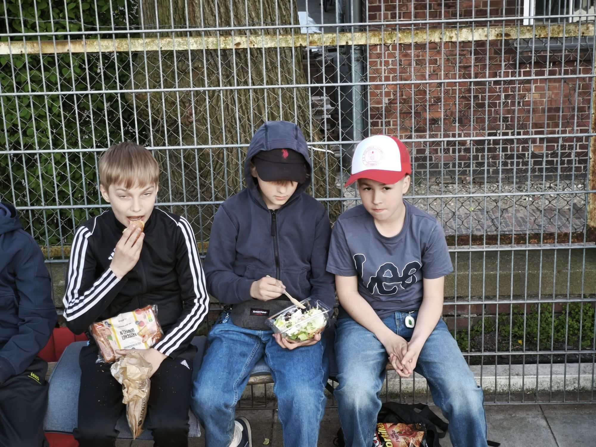
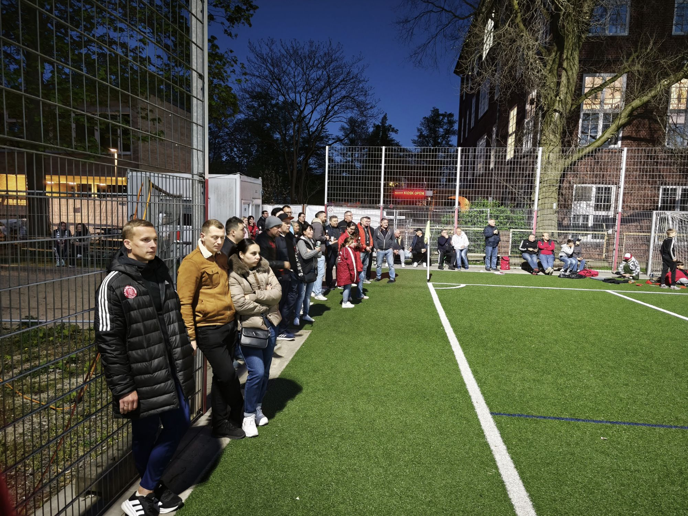
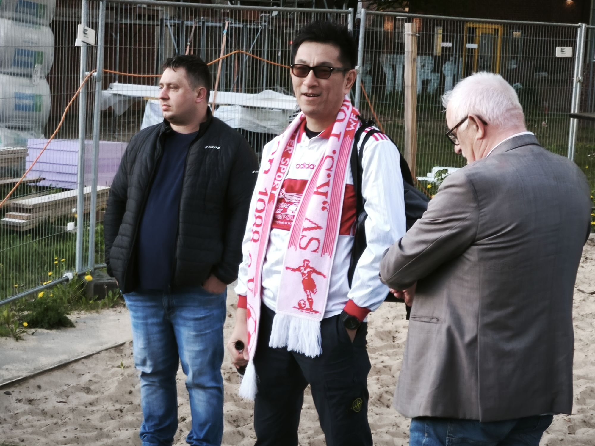
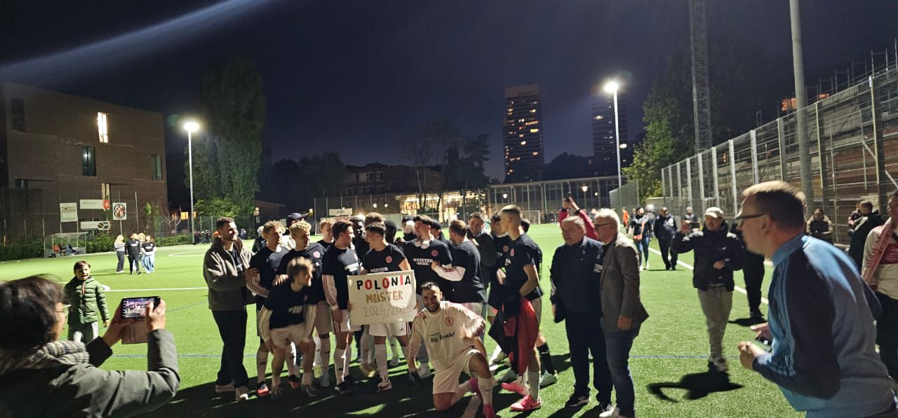
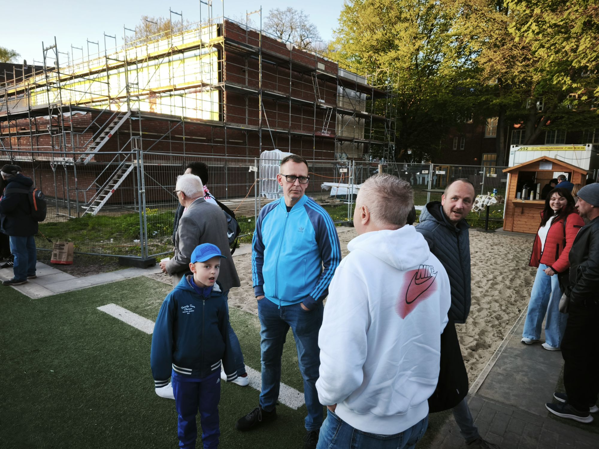
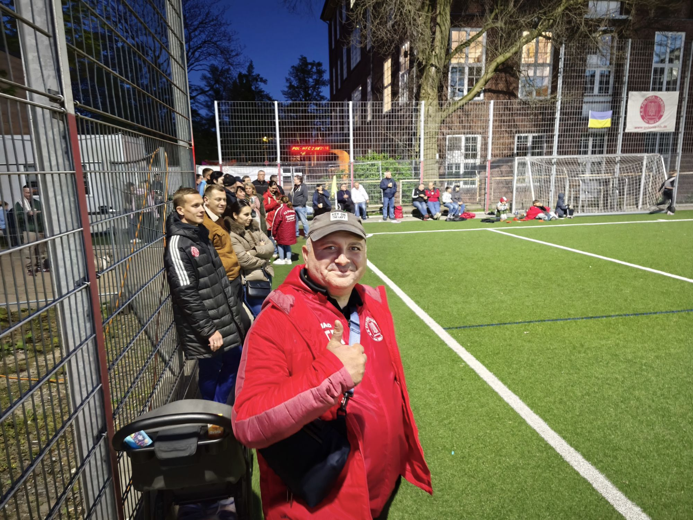
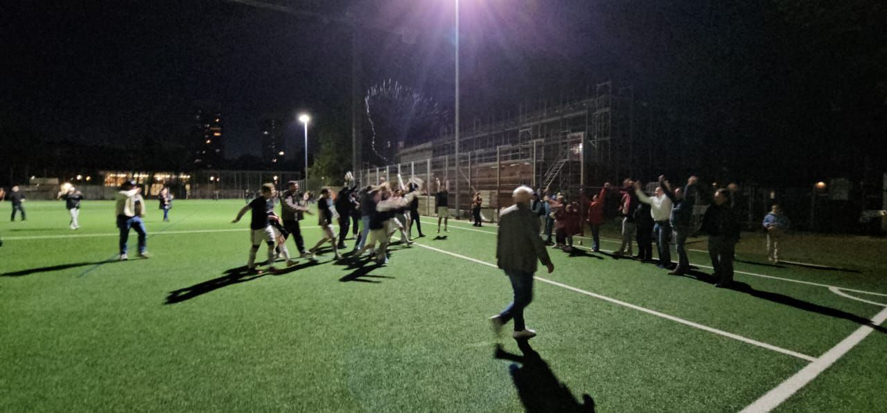
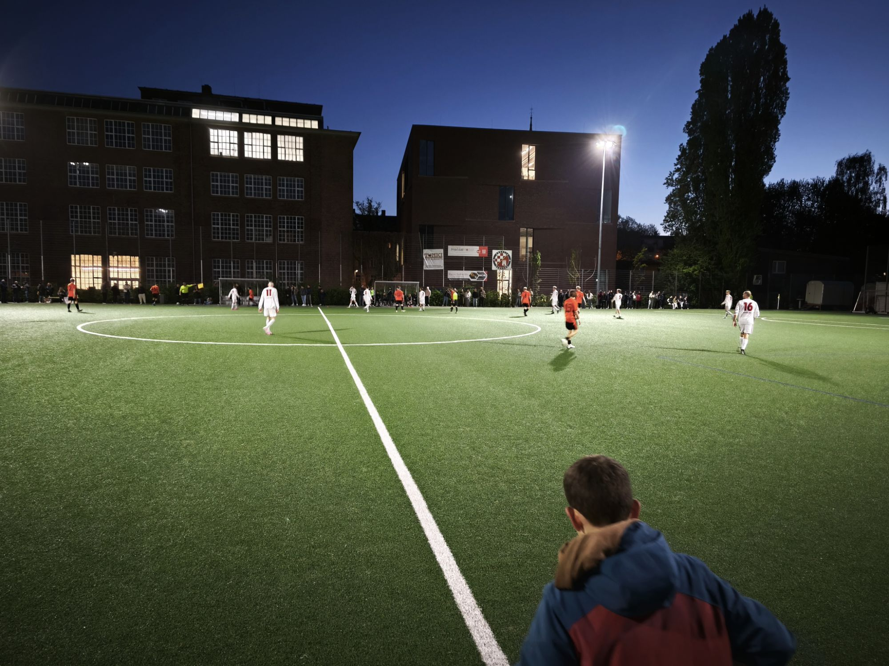

  
Was für ein Abend! Vor rund 250 begeisterten Zuschauern feierte KS Polonia an der traditionsreichen Finkenau ein glanzvolles Comeback in die Kreisliga. Mit einem überzeugenden 4:0-Erfolg über den HafenCity FC krönte das Team eine Saison der Wiedergutmachung.

## Der Weg zurück: Von der Krise zum Aufstieg

Nach einer schwierigen Phase und einer enttäuschenden Saison 24/24, die im Abstieg in die Kreisklasse gipfelte, schaffte das Team unter Cheftrainer **Ahmad Naeem** und seinem engagierten Assistenten **Thorsten Paysen** die Wende. Die beiden Coaches formten aus einer verunsicherten Mannschaft wieder eine echte Einheit – leidenschaftlich, fokussiert und siegeshungrig. Ihr Engagement, ihre Leidenschaft und ihre Vision haben den KS Polonia wieder auf Kurs gebracht.

## Das Spiel: Ein Feuerwerk unter Flutlicht

In einer elektrisierenden Atmosphäre, getragen von den lautstarken Fans, dominierte KS Polonia das Aufstiegsspiel von Beginn an:

-   **40\. Minute**: Der Auftakt! **Oleksandr Hetman** verwandelte sicher einen Strafstoß zur Führung.
    
-   **55\. Minute**: **Dmytro Dziuba** erhöhte mit einem feinen Abschluss auf 2:0 – der Bann war endgültig gebrochen.
    
-   **77\. Minute**: **Jasper Philipp Görtz** traf zum 3:0 und sorgte damit für klare Verhältnisse.
    
-   **90\. Minute**: Den Schlusspunkt setzte **Leonhard Hagen Rothmann**, der in der Nachspielzeit den 4:0-Endstand besorgte.
    

Mit diesem Sieg bewies Polonia eindrucksvoll seine neue Stärke und Leidenschaft – Attribute, die während der gesamten Saison hart erarbeitet wurden.

## Ein Ausblick voller Hoffnung

Mit einer tollen Mannschaft, einem sympathischen und kompetenten Trainerteam sowie einer begeisterten Fangemeinde blickt KS Polonia voller Vorfreude auf die kommende Saison in der Kreisliga. Die Rückkehr auf die höhere Ebene markiert nicht nur sportlich einen Neubeginn, sondern auch ein emotionales Highlight für den gesamten Verein.

Wir gratulieren KS Polonia herzlich zum Aufstieg und freuen uns auf eine spannende neue Spielzeit!

\[video width="848" height="394" mp4="../../../assets/images/VID-20250425-WA00131.mp4"\]\[/video\]

    

[bahis siteleri](https://mendels-oslo.com/ "canlı bahis siteleri") [bahis siteleri](https://burgybrews.com/ "bahis siteleri") [1xbet mobil](https://www.museumspoon.com/ "1xbet mobil") [deneme bonusu veren siteler](https://kuwaitcancercenter.net/ "deneme bonusu veren siteler")
