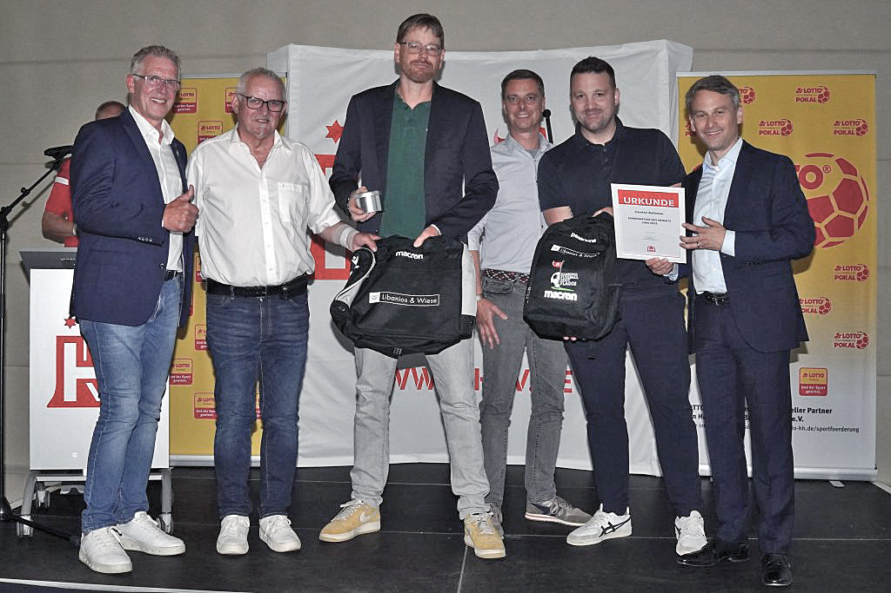

 Der Hamburger Fußball Verband (HFV) hat unseren Jugendbetreuer **Carsten Bullemer** zum Ehrenamtler des Monats gekürt. Der Verband würdigt mit dieser Auszeichnung außerordentliches ehrenamtliches Engagement in den Vereinen. Die Ehrung fand am 28. Juni 2023 im Rahmen der Meisterfeier des HFV statt. Carsten betreut unsere G- und F-Jugendspieler und unterstützt sportlich und organisatorisch den Trainer Vlad. Die Spieler können sich nun über hochwertige Sporttaschen vom Sponsor Libanios & Wiese freuen, die Carsten zusammen mit der Urkunde von der Feier mitgebracht hat. Polonia sagt: Danke, Carsten! Wir sind glücklich, dass Du da bist! - Foto: Gettschat (HFV)
