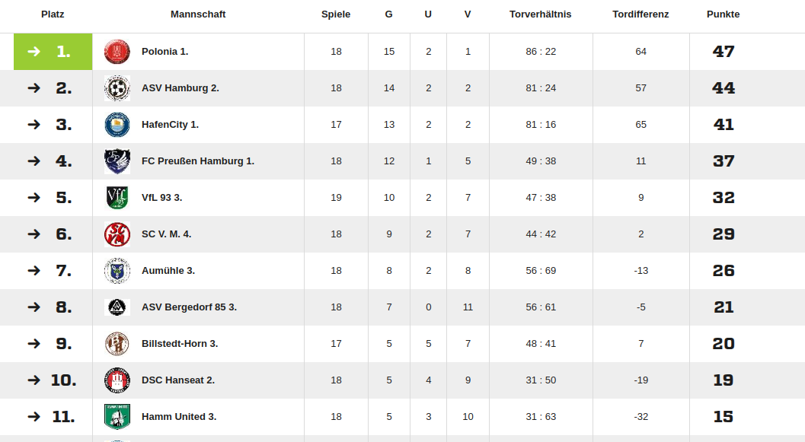

**In** der Hamburger Kreisklasse steht am Freitagabend, 7. März  2025 ein absolutes Topspiel auf dem Programm. Der Tabellenführer **KS Polonia Hamburg** empfängt den direkten Verfolger **ASV Hamburg 2** zum möglicherweise entscheidenden Duell um den Aufstieg. Anstoß ist um **20:00 Uhr im Stadion Finkenau**.

Nach **18 Spieltagen** steht **Polonia Hamburg mit 47 Punkten** an der Spitze der Tabelle. Der Vorsprung auf den Zweitplatzierten **ASV Hamburg 2 beträgt nur drei Punkte** – mit einem Sieg könnten die Gäste also gleichziehen und das Rennen um den Aufstieg neu entfachen. Polonia hingegen könnte mit einem Erfolg einen entscheidenden Schritt Richtung Meisterschaft und Aufstieg machen.

## **Spannender Kampf um die Torjägerkrone**

Nicht nur der Aufstiegskampf sorgt für Spannung, sondern auch das Rennen um die Torjägerkrone. Gleich drei Spieler haben realistische Chancen, sich am Saisonende den Titel als Torschützenkönig zu sichern:

**Platz**

**Spieler**

**Mannschaft**

**Tore**

1.

**Jonah Paul Engels**

HafenCity 1

**26**

2.

**Oleksandr Hetman**

Polonia Hamburg

**25**

3.

**Bahier Ahmad**

ASV Hamburg 2

**24**

Vor allem **Hetman (Polonia) und Ahmad (ASV)** könnten in diesem Topspiel mit Toren ihre Chancen auf die Torjägerkrone weiter erhöhen.

## **Alles angerichtet für ein Fußballfest – Kiosk geöffnet!**

Die Voraussetzungen für einen packenden Fußballabend sind gegeben. Beide Teams sind in Topform, die Tabellensituation verspricht ein echtes Endspiel um den Aufstieg, und auch für das leibliche Wohl ist gesorgt: Der **Kiosk ist geöffnet**, es gibt **Bratwurst und Getränke** für alle Fans, alle Nachbarn sind eingeladen - Eintrittt: 3 Euro !

### **Kommt vorbei und unterstützt euer Team!**

? **Wann?** Freitag, **7\. März 2025**, 20:00 Uhr, Eintritt: 3 Euro  
? **Wo?** Stadion Finkenau, Eint  
? **Verpflegung?** Bratwurst & Getränke am Kiosk

Die Entscheidung im Aufstiegsrennen könnte an diesem Abend fallen – wir sehen uns auf dem Platz! ⚽?

[https://reactoonzs.com/](https://reactoonzs.com/)
