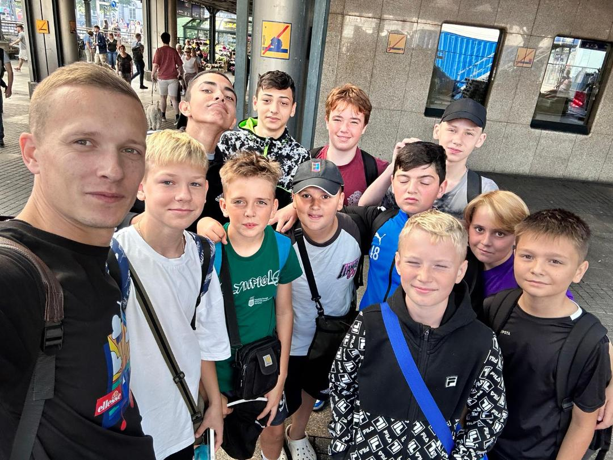

Bei hochsommerlichen Temperaturen um die 30 Grad ging es heute für Sascha und die Spieler der C-Jugend elbabwärts zum Auswärtsspiel nach Seestermühe. Tengiz und seine Jungs hatten es nicht so weit: sie empfingen Alstertal-Langenhorn an der heimischen Finkenau. Auf beiden Plätzen hatten die Rot-Weißen den Gegner fest im Griff. In Seestermühe stand es am Ende 7:5 für Polonia. Auf dem Heimplatz siegten unsere Jungs deutlich mit 6:1. Eine Starke Leistung unserer Mannschaften aus dem Polonia-Ukraine-Projekt. So kann es es gerne weitergehen, Danke Jungs, Danke Trainer!

Nach dem Heimsieg

Auf dem Weg nach Seestermühe

So sehen Sieger aus!
