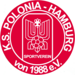

Liebe Fans und Unterstützer des KS Polonia, mit Bedauern möchten wir bekanntgeben, dass sich der Verein aufgrund anhaltenden sportlichen Niedergangs und mangelnden Erfolgs von Trainer Tomasz Pol getrennt hat. Tomasz hat das Traineramt seit 2012 innegehabt und maßgeblich dazu beigetragen, die erste Mannschaft zu prägen und zu unterstützen. Für seinen langjährigen Einsatz als Trainer sprechen wir ihm unseren herzlichen Dank aus. Tomasz, auch liebevoll Tomek genannt, hat sich über viele Jahre hinweg mit großem Engagement dem Verein gewidmet. Sein Beitrag zur Entwicklung der Mannschaft wird nicht vergessen, und wir wünschen ihm für seine Zukunft alles Gute. Aufgrund der aktuellen sportlichen Lage hat der KS Polonia beschlossen, eine Veränderung vorzunehmen. Interimsmäßig wird der ukrainische Trainer Volodymyr Herasymets das Traineramt übernehmen. Gerasymets verfügt über Erfahrung als Fußballprofi in der ersten ukrainischen Liga und hat sich später als Trainer in der Ukraine erfolgreich bewiesen. Wir hoffen auf das Verständnis unserer Fans für diese notwendige Entscheidung und bitten um Unterstützung für das Team unter der interimistischen Leitung von Volodymyr Herasymets in den nächsten Spielen. Vielen Dank für eure fortwährende Unterstützung. Mit sportlichen Grüßen, der Vorstand der K.S. Polonia 
