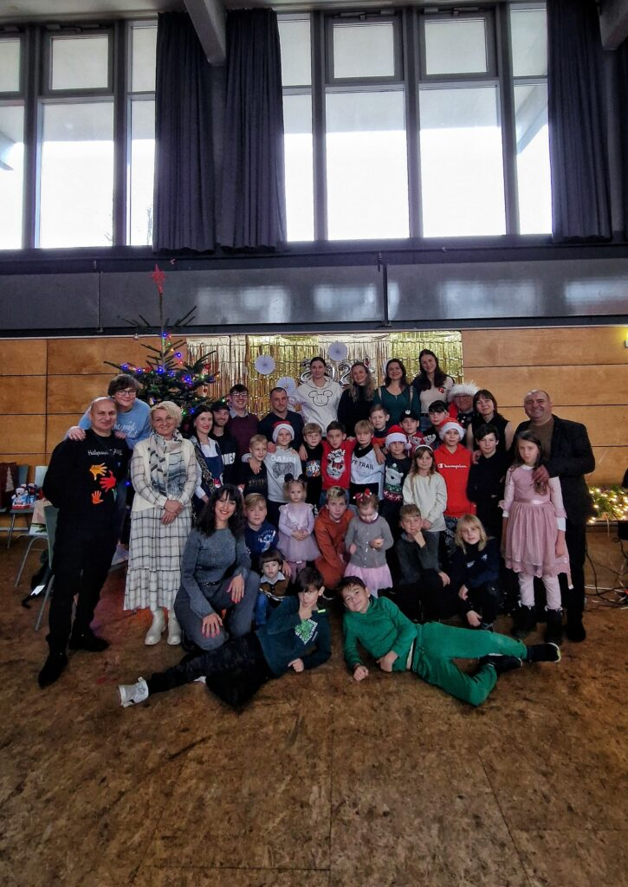
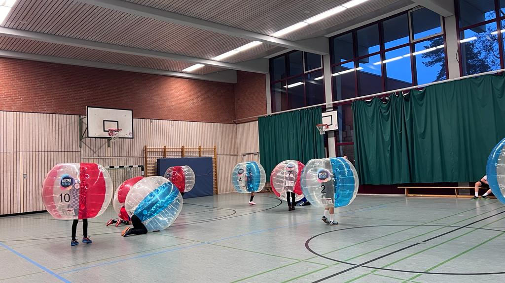

Am 10. Dezember 2023 versammelte sich die Gemeinschaft des KS Polonia in der festlich geschmückten Sporthalle des Gymnasiums Lerchenfeld, um gemeinsam das traditionelle Weihnachtssingen zu zelebrieren. Das Event versprach nicht nur harmonische Klänge, sondern auch eine Mischung aus kulinarischem Genuss und sportlichem Spaß. Die Veranstaltung zog nicht nur Mitglieder des Vereins an, sondern auch Besucher aus dem Viertel, Schülerinnen und Schüler der Schule sowie ukrainische Flüchtlinge, die eine besondere Rolle in der Veranstaltung einnahmen. Die festliche Atmosphäre der Sporthalle wurde durch die stimmungsvolle Beleuchtung und die Dekoration mit weihnachtlichen Motiven verstärkt. Die Zuschauer, darunter Menschen unterschiedlicher Herkunft und Hintergründe, genossen die herzerwärmenden Weihnachtslieder, die von den talentierten Mitgliedern des KS Polonia vorgetragen wurden. Nach dem emotionalen Teil des Abends ging es in die nächste Phase über – kulinarischer Genuss. Die Besucher wurden mit köstlichem Essen verwöhnt, das die Vielfalt der kulinarischen Traditionen widerspiegelte. Die festliche Tafel lud zu gemeinsamen Gesprächen und genussvollen Momenten ein, die die Solidarität und Vielfalt der Gemeinschaft unterstrichen. Eine besondere Würdigung erhielten auch die engagierten Trainer des KS Polonia, die maßgeblich zum Erfolg der Veranstaltung beitrugen. Ihr Einsatz und ihre Begeisterung trugen dazu bei, dass das Weihnachtssingen nicht nur ein musikalisches Ereignis, sondern auch ein Symbol der Gemeinschaft wurde. Neben den traditionellen Feierlichkeiten wurde das Fest durch eine sportliche Note bereichert – eine Runde Bubble-Fußball. In aufblasbaren Anzügen tobten die Teilnehmer, darunter auch ukrainische Flüchtlinge, über das Spielfeld und erlebten dabei nicht nur sportlichen Wettbewerb, sondern auch eine Menge Spaß und gemeinsame Freude. Die Kombination aus Weihnachtssingen, kulinarischen Köstlichkeiten, sportlichem Vergnügen, Solidarität mit ukrainischen Flüchtlingen und dem Engagement der Trainer machte das Fest zu einem unvergesslichen Erlebnis für die Mitglieder des KS Polonia und ihre Gäste. Die gelungene Veranstaltung stärkte nicht nur die Gemeinschaftsbindung, sondern schuf auch schöne Erinnerungen an ein einzigartiges und vielfältiges Weihnachtsfest im Jahr 2023.  
