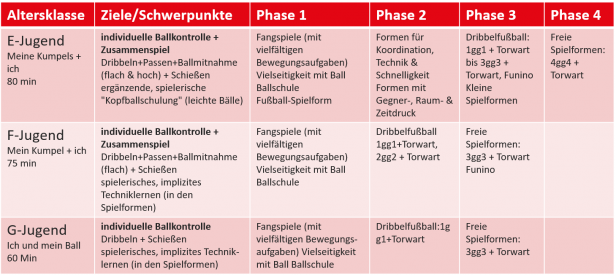
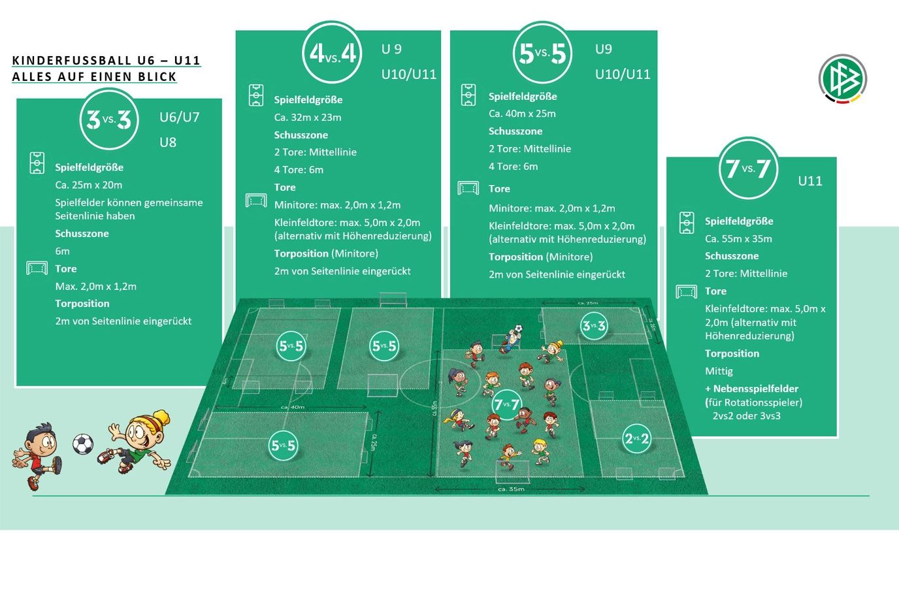

## Trainingsformen und Trainingseinheiten

Das Kindesalter ist die sensible Phase für die Entwicklung der koordinativen Fähigkeiten und der Kreativität. Durch viele unterschiedliche Spiele mit Elementen aus unterschiedlichen Sportarten erlernen die Kinder spielerisch die Grundmotorik und werden zu kreativen Bewegungstalenten. Kinder, die frühzeitig ein breites Bewegungsspektrum erlernen, können später auf einem breiteren Grundgerüst an koordinativen Fähig- und Fertigkeiten sowie Lösungsfindungen aufbauen. Dies wirkt sich auch positiv auf die Fußballfähigkeiten aus.

 

## G-Jugend - Trainingseinheit

Phase 1 - Spiel\_Spielerisches Üben Phase 2 - Spielform 1 Phase 3 - Spielform 2 Phase 1 - Spiel\_Spielerisches Üben Diese Phase sollte zeitlich ca. 25 % der Trainingseinheit (ca. 15 min) ausmachen.

Download:

1.   [G-Jugend\_Phase 1 Spielerisches Üben\_Ballschule.pdf](https://sbfv.de/sites/default/files/G-Jugend_Phase%201%20Spielerisches%20%C3%9Cben_Ballschule_0.pdf)
2.   [G-Jugend\_Phase 1 – Spielerisches Üben\_Fangspiele.pdf](https://sbfv.de/sites/default/files/G-Jugend_Phase%201%20-%20Spielerisches%20%C3%9Cben_Fangspiele_0.pdf)
3.   [G-Jugend\_Phase 1 Spielerisches Üben\_Vielseitigkeit mit Ball.pdf](https://sbfv.de/sites/default/files/G-Jugend_Phase%201%20Spielerisches%20%C3%9Cben_Vielseitigkeit%20mit%20Ball.pdf)

Phase 2 - Spielform 1 In der G-Jugend-Entwicklungs-Stufe „Ich und mein Ball“ sind die Kinder ballfixiert. Mitspieler spielen noch keine große Rolle, was in dieser Altersgruppe in Ordnung ist. Bei der Durchführung sollte man als Trainer flexibel sein und vor allem darauf achten, dass alle Kinder zu jeder Zeit spielen können. Ob die Kids auf Mini-, Stangen- oder Kegel-Tore kicken ist ebenso unerheblich wie die Mannschaftsgröße (1 gegen 1, 2 gegen 2 oder 3 gegen 3).  
  
Diese Phase sollte zeitlich ca. 50 % der Trainingseinheit (ca. 30 min) ausmachen.Download:

1.   [G-Jugend\_Phase 2\_Spielform 1.pdf](https://sbfv.de/sites/default/files/G-Jugend_Phase%202_Spielform%201_0.pdf)

Phase 3 - Spielform 2 Für G-Jugend-Anfänger ist das 3 gegen 3 mit Torhütern ausreichend. Diese Form wird auch bei den G-Jugend-Spieltagen gespielt, daher sollte sie im Training unbedingt durchgeführt werden.  
  
Diese Phase sollte zeitlich ca. 25 % der Trainingseinheit (ca. 15 min) ausmachen.Download:

1.   [G-Jugend\_Phase 3 Spielform 2.pdf](https://sbfv.de/sites/default/files/G-Jugend_Phase%203%20Spielform%202_0.pdf)

## F-Jugend

Phase 1 - Spiel\_Spielerisches Üben Phase 2 - Spielform 1 Phase 3 - Spielform 2 Phase 1 - Spiel\_Spielerisches Üben Diese Phase sollte zeitlich ca. 25 % der Trainingseinheit (ca. 18 min) ausmachen.Download:

1.   [F-Jugend\_Phase 1 Spielerisches Üben\_Ballschule.pdf](https://sbfv.de/sites/default/files/F-Jugend_Phase%201%20Spielerisches%20%C3%9Cben_Ballschule_0.pdf)
2.  [F-Jugend\_Phase 1 – Spielerisches Üben\_Fangspiele.pdf](https://sbfv.de/sites/default/files/F-Jugend_Phase%201%20-%20Spielerisches%20%C3%9Cben_Fangspiele.pdf)
3.  [F-Jugend\_Phase 1 Spielerisches Üben\_Vielseitigkeit am Ball.pdf](https://sbfv.de/sites/default/files/F-Jugend_Phase%201%20Spielerisches%20%C3%9Cben_Vielseitigkeit%20am%20Ball_0.pdf)

Phase 2 - Spielform 1 Dribbelfußball und die weiteren kleinen Spielformen sollten im Mittelpunkt des Trainings stehen und die meiste Zeit einnehmen, da die Kinder in diesen Formen mit vielen Ballaktionen die Basistechniken spielerisch erlernen. Bei der Durchführung sollte man als Trainer flexibel sein und vor allem darauf achten, dass alle Kinder zu jeder Zeit spielen können.  
  
Diese Phase sollte zeitlich ca. 40 % der Trainingseinheit (ca. 30 min) ausmachen.Download:

1.   [F-Jugend\_Phase 2 Spielform 1\_Dribbelfußball.pdf](https://sbfv.de/sites/default/files/F-Jugend_Phase%202%20Spielform%201_Dribbelfu%C3%9Fball_0.pdf)

Phase 3 - Spielform 2 Auch in Phase 3 des F-Jugend Trainings, stehen die Spielformen im Mittelpunkt. Das Trainingsmodell entspricht hierbei den neuen Fair-Play-Spieltagen und sollte auch im Training gespielt werden. In dieser Phase können zudem auch Funino und Funino-Variationen gespielt werden.  
  
Diese Phase sollte zeitlich ca. 35 % der Trainingseinheit (ca. 27 min) ausmachen.Download:

1.  [F-Jugend\_Phase 3 Spielform 2\_Freie Spielform.pdf](https://sbfv.de/sites/default/files/F-Jugend_Phase%203%20Spielform%202_Freie%20Spielform_0.pdf)
2.  [F-Jugend\_Phase 3 Spielform 2\_Funino.pdf](https://sbfv.de/sites/default/files/F-Jugend_Phase%203%20Spielform%202_Funino_0.pdf)

## E - Jugend

Phase 1 - Spiel\_Spielform Phase 2 - Spielerisches Üben Phase 3 - Spielform 1 Phase 4 - Spielform 2 Phase 1 - Spiel\_Spielform Diese Phase sollte zeitlich ca. 25 % der Trainingseinheit (ca. 20 min) ausmachen.Download:

1.  [E-Jugend\_Phase 1 Spiel oder Spielform\_Ballschule.pdf](https://sbfv.de/sites/default/files/E-Jugend_Phase%201%20Spiel%20oder%20Spielform_Ballschule.pdf)
2.  [E-Jugend\_Phase 1\_Spiel oder Spielform\_Fangspiele.pdf](https://sbfv.de/sites/default/files/E-Jugend_Phase%201_Spiel%20oder%20Spielform_Fangspiele.pdf)
3.  [E-Jugend\_Phase 1 Spiel oder Spielform\_Fußballspiele.pdf](https://sbfv.de/sites/default/files/E-Jugend_Phase%201%20Spiel%20oder%20Spielform_Fu%C3%9Fballspiele.pdf)
4.  [E-Jugend\_Phase 1 Spielerisches Üben\_Vielseitigkeit mit Ball.pdf](https://sbfv.de/sites/default/files/E-Jugend_Phase%201%20Spielerisches%20%C3%9Cben_Vielseitigkeit%20mit%20Ball.pdf)

Phase 2 - Spielerisches Üben Generell gilt der Leitgedanke „Spielen dem Üben vorziehen“ – es sollte im Training also viel gespielt werden. Übungsformen sind in der 2. Phase der Einheit ein hinleitendes Element zum Schwerpunkt des Trainings. In den Formen können die Techniken mit weniger Zeit-, Raum- und Gegnerdruck geübt werden, um sie dann in den Spielformen anwenden zu können. Die Kinder lernen die Techniken aber vor allem im Spiel, nicht im „Ums-Hütchen-Dribbeln“!  
  
Diese Phase sollte zeitlich ca. 25 % der Trainingseinheit (ca. 20 min) ausmachen.Download:

1.  [E-Jugend\_Phase 2\_Übungsform.pdf](https://sbfv.de/sites/default/files/E-Jugend_Phase%202_%C3%9Cbungsform.pdf)

Phase 3 - Spielform 1 Dribbelfußball und die weiteren kleinen Spielformen sollten im Mittelpunkt des Trainings stehen und die meiste Zeit einnehmen, da die Kinder in diesen Formen mit vielen Ballaktionen die Basistechniken spielerisch erlernen.  
  
Diese Phase sollte zeitlich ca. 25 % der Trainingseinheit (ca. 20 min) ausmachen.Download:

1.  [E-Jugend\_Phase 3\_Spielform 1\_Dribbelfußball.pdf](https://sbfv.de/sites/default/files/E-Jugend_Phase%203_Spielform%201_Dribbelfu%C3%9Fball.pdf)
2.  [E-Jugend\_Phase 3\_Spielform 1\_Funino.pdf](https://sbfv.de/sites/default/files/E-Jugend_Phase%203_Spielform%201_Funino.pdf)
3.  [E-Jugend\_Phase 3\_Spielform 1\_Kleine Spielformen.pdf](https://sbfv.de/sites/default/files/E-Jugend_Phase%203_Spielform%201_Kleine%20Spielformen.pdf)

Phase 4 - Spielform 2 In freien Spielformen haben alle Kinder viele Ballaktionen und damit viele Möglichkeiten, sich auszuprobieren, Fehler zu machen und somit spielerisch selbstentdeckend zu lernen.  
  
Diese Phase sollte zeitlich ca. 25 % der Trainingseinheit (ca. 20 min) ausmachen.Download:

1.  [E-Jugend\_Phase 4\_Freie Spielform.pdf](https://sbfv.de/sites/default/files/E-Jugend_Phase%204_Freie%20Spielform_0.pdf)
